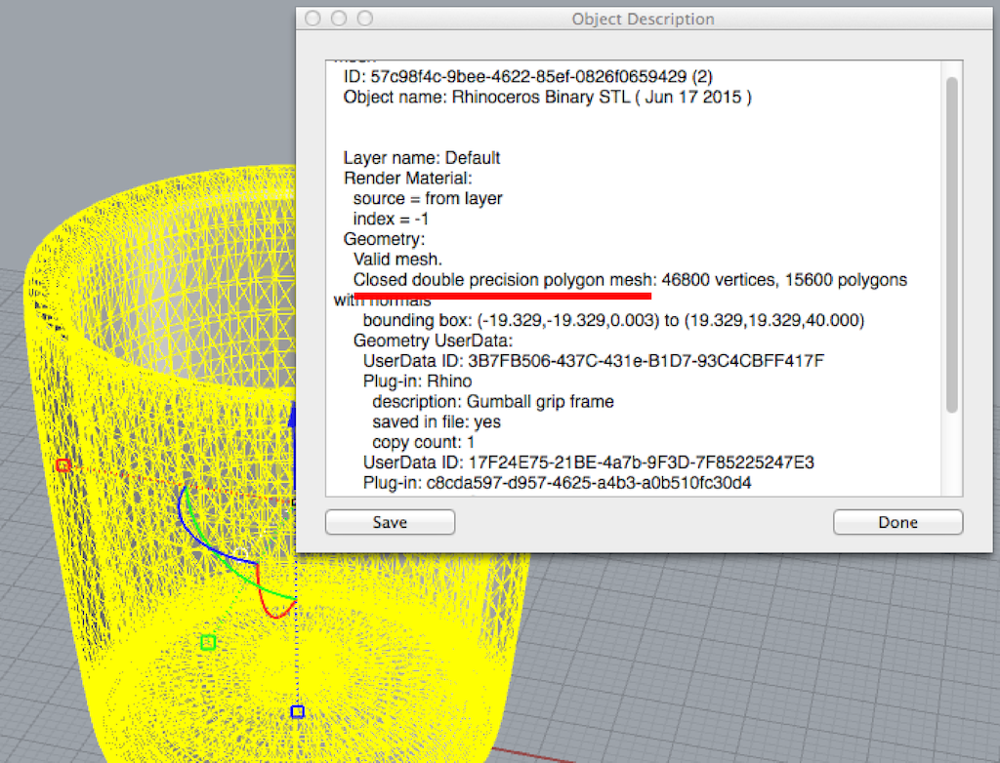
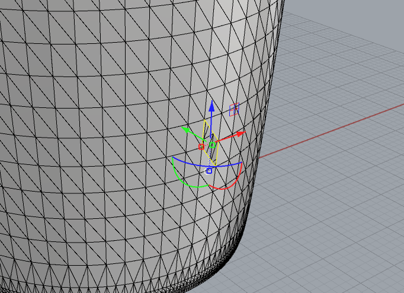
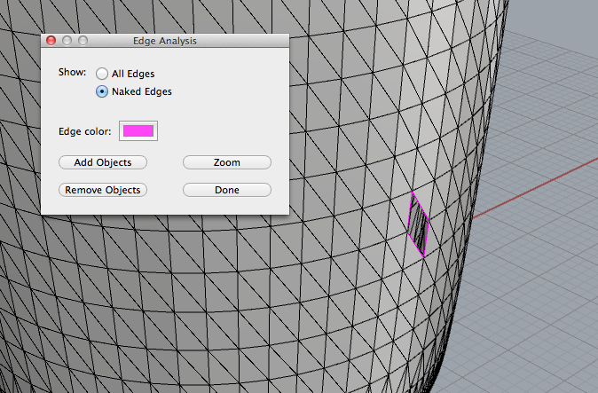

# STLデータの分析

スキャンしたり、ダウンロードしたSTLファイルにはそのままプリントできないものもある。

どこに問題があるのかモデルを分析して見つける。

まずは、**[STLファイル](stl/guinomi_broken.stl)**をRhinoで開く。

## Whatコマンド

STLファイルはMeshオブジェクトとして読み込まれる。

通常のRhinoコマンドが使えない場合もある。

ただし、前述した"What"コマンドでオブジェクトの情報を読み取ることができる。

”Closed polygon mesh”の文字があれば3Dプリント可能な**閉じた**メッシュ

## DupBorderコマンド

もしも、メッシュが閉じていなけばドコが開いているか見つけ出す必要がある。

"DupBorder"コマンドを打ち込むとメッシュの開いたエッジがコピーされ選択される。

## ShowEdgeコマンド

また、"ShowEdges"コマンドでも開いたメッシュのエッジを見つけることができる。

”ShowEdges”コマンドを打ち込み、Naked Edgesを選択することで開いた部分がハイライトされる。

"DupBorder"コマンドのようにエッジがコピーされない。

