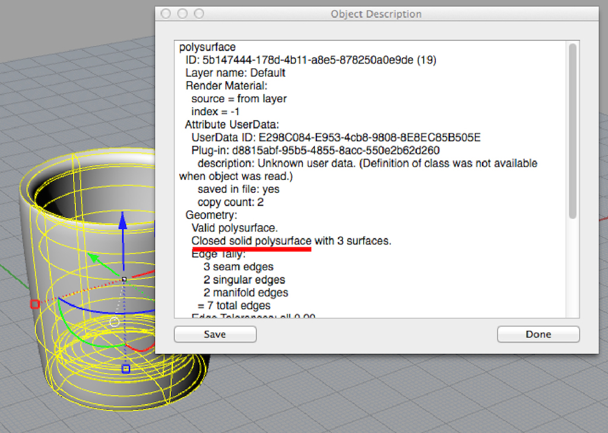
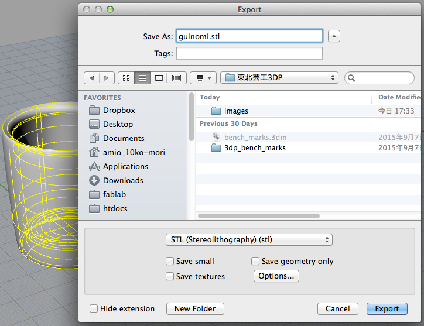
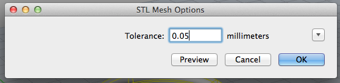
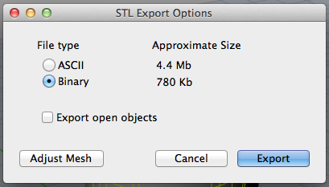

# STLデータの書き出し

3Dプリントをするには３DデータをSTL形式で書き出す必要がある。

#### １．閉じたポリサーフェイスであることを確認

開いたサーフェイスはただの”面”なのでプリントできない、

書き出したいオブジェクトを選択し、"What "とコマンドを打つ。

表示されるウィンドウで閉じたポリサーフェイスかどうかを確認。

”**SelClosedPolysrf**”と打てば閉じたポリサーフェイスが全て選択される。

#### ２．選択→Export

プリントしたいオブジェクトを選択して、

"Export"コマンドを打ち込む。

ファイル形式は"STL"にして、任意の場所に保存。

次にToleranceを入力するウィンドウが出てくるが、

大体0.05mm程度にしておけば、3DPの精度以上のデータになるので問題なし。

ここをより小さい値にすると、よりきめ細かいSTLデータが書き出される

（その分データサイズも増える）

ファイルタイプが聞かれるので、Binaryを選んで書き出し完了。

